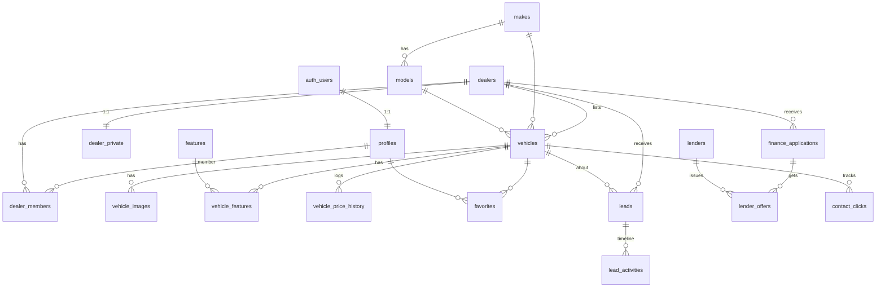

# PLAN.md: Car Platform (Web + Mobile Marketplace & Management Console)

> Working codename `car-platform`, npm scope `@cp/*`. The brand name, logo, WhatsApp number and phone are configurable in `site_settings`.

## 0. Product summary

This is a modern dealership plus a multi-dealer marketplace. Buyers browse, filter, compare and finance-shop on a refined web storefront and a fast Expo app. **There is no online checkout.** Every vehicle page ends in **"Contact via WhatsApp"** (deep link with a prefilled message) and **"Call Us"**. Admins and approved sub-dealers manage inventory, photos, prices and leads from **both** the web dashboard and the mobile app.

| Principle                   | Implication                                                                                                         |
| --------------------------- | ------------------------------------------------------------------------------------------------------------------- |
| DB is the security boundary | RLS + RPCs enforce all rules, because mobile hits Supabase directly                                                 |
| Share logic, not UI         | `@cp/core`, `@cp/validators`, `@cp/api`, `@cp/types`, `@cp/design-tokens` are shared. UI is native to each platform |
| Exact data                  | Every spec and the price shown verbatim. A publish gate requires the mandatory fields                               |
| Conversion = conversation   | WhatsApp/Call CTAs are tracked (`contact_clicks`). Inquiries and finance apps feed the CRM                          |

---

## 1. UX & Technical Scope

### 1.1 Roles

| Role                                              | How obtained                                           | Can do                                                                                                                            |
| ------------------------------------------------- | ------------------------------------------------------ | --------------------------------------------------------------------------------------------------------------------------------- |
| **Visitor** (anon)                                | -                                                      | Browse, filter, compare, calculators, WhatsApp/Call, submit inquiry / finance application                                         |
| **Buyer**                                         | Sign up (email OTP / magic link, Google, Apple on iOS) | All of the above, plus synced favorites and history of their inquiries and applications                                           |
| **Dealer member** (`owner` / `manager` / `staff`) | Applies with "Sell with us" → admin approves           | Manage **own dealer's** inventory, photos, prices, leads and finance apps. Owner/manager also edit the dealer profile and members |
| **Admin**                                         | Set by another admin (or seeded)                       | Everything: all inventory, dealer approvals, catalog, CRM, site settings, users, audit log                                        |

The house dealership is a `dealers` row with `is_house = true`. Admin-entered inventory belongs to it, so **every vehicle has a dealer**.

### 1.2 Buyer flow (web & mobile)

```
Home / Discover ──► Inventory (filters + sort + search) ──► Vehicle Detail Page
   │                    │  ▲                                   │  ├─ Gallery (fullscreen, zoom, swipe)
   │                    │  └─ Save search / favorite ◄─────────┤  ├─ Price + all specs + features + history
   │                    └─► Compare (≤4, diff-highlight) ◄──────┤  ├─ Payment estimate (inline calculator)
   │                                                            │  ├─ [Contact via WhatsApp]  ← primary CTA
   ├─► Financing hub ─► Budget calculator ─► Pre-qual app ─►    │  ├─ [Call Us]
   │                    (simulated 1,200+ lender network)        │  ├─ Inquiry / test-drive / trade-in form
   │                         └─► Simulated offers (realtime)     │  └─ Dealer card → Dealer storefront
   └─► Account: favorites · my inquiries · my applications
```

1. **Discover:** a hero search (make/model/budget), body-type tiles, featured and price-drop rails, "recently sold" and trust badges.
2. **Inventory:**
   - **Filter facets:** make → model (dependent), year range, price range, mileage max, body type, drivetrain, fuel type, transmission, condition, exterior color, seats, features, and dealer.
   - Facet counts are live.
   - **Sort:** newest, price ↑/↓, mileage ↑, year ↓.
   - Free-text search uses tsvector.
   - **Web layout:** sticky filter rail on desktop, filter sheet on small screens, URL-synced so links are shareable, infinite grid with blurhash placeholders.
   - **Mobile layout:** FlashList, filter bottom sheet, chips row for active filters.
3. **VDP:**
   - Gallery (thumbnails + lightbox on web, pinch-zoom pager on mobile).
   - A title bar with year make model trim, **price**, mileage, and stock # / VIN (copyable).
   - Spec sections: Overview / Powertrain / Body & Interior / History / Features (grouped by category), then the description and dealer card.
   - Price-drop badge from `vehicle_price_history`.
   - **Sticky CTA bar** (WhatsApp + Call) on mobile web and in the app. On desktop it is a sticky card in the right column.
   - The WhatsApp message is prefilled: `Hi! I'm interested in the 2021 BMW X5 xDrive40i (Stock #A123, VIN …) listed at $45,990 – <url>`.
   - The number is `dealer.whatsapp_e164`, falling back to `site_settings.default_whatsapp_e164`.
4. **Compare:** pick up to 4 vehicles from cards/VDP into a floating tray (persisted locally). `/compare?ids=` is shareable. Spec rows highlight differences and can hide identical rows.
5. **Financing:**
   - Payment calculator (price, down payment, trade-in, APR by credit tier, term, tax and fees).
   - Budget calculator (monthly budget → max vehicle price).
   - A multi-step pre-qualification application, submitted to the `simulate-lender-match` Edge Function. Offers stream in through Realtime ("Matching across 1,200+ lenders…").
   - Clear "simulated / not a credit decision" disclosures. **No SSN or full DOB is collected.**
6. **Lead capture:** general inquiry, test-drive request and trade-in request (VIN/plate, mileage, condition, photos optional). Each creates a `leads` row routed to the vehicle's dealer (or the house dealer).

### 1.3 Sub-dealer flow (web & mobile)

```
Sell with us ─► Sign up/in ─► Dealer application (business info, license #, contact, WhatsApp, docs)
     ─► status = pending (can prepare DRAFT listings, cannot publish)
     ─► Admin approves ─► status = approved, notified (email + push)
     ─► Dashboard: Inventory · Leads · Finance apps · Dealer profile · Team
```

- **Create listing:**
  1. Enter or **scan the VIN.** Mobile reads the Code 39/128 barcode with `expo-camera`, and `decode-vin` (NHTSA vPIC) autofills year/make/model/trim/engine/drivetrain/fuel/body.
  2. Fill in the price, mileage, colors and history.
  3. Tick feature checkboxes.
  4. Upload photos (multi-select, drag/long-press to reorder, set cover).
  5. Publish.
- **Publish gate (DB trigger):** the dealer is approved, there is ≥1 image, price > 0, and the required spec fields are present. If `site_settings.require_listing_review = true` and the dealer is not the house dealer, the status goes to `pending_review` for admin approval.
- **Manage:** quick inline price edit (logged to price history), status changes (active ↔ reserved → sold → archived), duplicate a listing, and bulk actions on web.
- **Leads:**
  - An inbox with unread markers and status pipeline (new → contacted → qualified → negotiating → won/lost), notes, and assignment to a team member.
  - Clicking reply opens WhatsApp/tel to the customer.
  - Push notification on a new lead.
- **Insights:** views, WhatsApp/Call clicks and leads per vehicle (last 30 days).

### 1.4 Admin flow (web & mobile)

- **Dealer approvals** queue: review the application and docs → approve / reject (reason) / suspend. Suspending hides all of that dealer's listings instantly through RLS.
- **Global inventory:** everything a dealer can do, across all dealers, plus feature, unpublish and approve `pending_review`.
- **CRM:** all leads and finance applications, with filters by dealer, status and source.
- **Catalog:** makes, models and features.
- **Site settings:** brand, default WhatsApp/phone, business hours, APR-by-tier table, listing review toggle.
- **Users:** promote/demote admin, view dealer memberships.
- **Audit log:** a read-only timeline of sensitive changes.

### 1.5 Route maps

**Web (`apps/web/app`)**

```
(storefront)/
  page.tsx                         Home
  inventory/page.tsx               Search + filters (URL state)
  inventory/[slug]/page.tsx        VDP (SSG-able + revalidate tags)
  compare/page.tsx
  financing/page.tsx               Hub + calculators
  financing/apply/page.tsx         Multi-step pre-qual
  financing/offers/[id]/page.tsx   Simulated offers (Realtime)
  dealers/[slug]/page.tsx          Dealer storefront
  sell-with-us/page.tsx            Dealer application
  trade-in/page.tsx · about/ · contact/
  account/(favorites|inquiries|applications)
(auth)/login · signup · auth/callback/route.ts
dashboard/                         role-aware console (proxy-gated)
  page.tsx                         KPIs
  inventory/ · inventory/new · inventory/[id]
  leads/ · leads/[id]
  finance/ · finance/[id]
  dealer/ (profile, team)                       [dealer owner/manager]
  dealers/ · dealers/[id]                       [admin]
  catalog/ · settings/ · users/ · audit/        [admin]
sitemap.ts · robots.ts · opengraph-image.tsx
```

**Mobile (`apps/mobile/app`)**

```
(tabs)/index        Discover
(tabs)/search       Inventory + filter sheet
(tabs)/saved        Favorites + compare tray
(tabs)/finance      Calculators + apply
(tabs)/account      Profile, my inquiries/apps, "Manage" entry (if dealer/admin)
vehicle/[id]        VDP (sticky WhatsApp/Call bar)
compare             Compare table (horizontal scroll)
(auth)/sign-in · verify
manage/_layout      Role gate (real /manage segment; groups would collide with tabs index)
manage/index        KPIs
manage/inventory · inventory/new (VIN scan) · inventory/[id] (photos, price, status)
manage/leads · leads/[id]
manage/finance · finance/[id]
manage/dealers · dealers/[id]   [admin]
```

### 1.6 Design direction ("unique, modernized")

- **Visual:** generous whitespace, edge-to-edge photography, a near-black "showroom" dark theme as the hero aesthetic with a light theme parity, one accent color, and soft glass surfaces for sticky bars.
- **Type:** a distinctive display face for headings plus a neutral sans for UI. Both are defined in `@cp/design-tokens`.
- **Motion:**
  - Web: card hover lift, View Transitions between grid → VDP, gallery crossfades.
  - Mobile: Reanimated shared-feel transitions and haptics.
  - Both respect `prefers-reduced-motion`.
- **Data density in the dashboard:** shadcn DataTable (TanStack Table) with column filters, inline edit for price/status, and keyboard shortcuts.

---

## 2. Architecture

### 2.1 Monorepo (Turborepo + pnpm workspaces)

```
car-platform/
├─ apps/web          → depends on @cp/{api,core,validators,types,design-tokens,config}
├─ apps/mobile       → depends on @cp/{api,core,validators,types,design-tokens,config}
├─ packages/api      → @cp/{types,validators,core}   (peer: @supabase/supabase-js, @tanstack/react-query)
├─ packages/validators → @cp/{types,core}             (zod, libphonenumber-js)
├─ packages/core     → (no runtime deps; Deno-importable for Edge Functions)
├─ packages/types    → (generated)
├─ packages/design-tokens → (plain TS objects + tailwind preset exports)
├─ packages/config   → eslint/tsconfig/prettier
├─ supabase/         → migrations, tests, functions, seed
├─ turbo.json  pnpm-workspace.yaml  .npmrc (node-linker=hoisted for Expo/Metro stability)
└─ .github/workflows/ci.yml
```

- Internal packages ship **TS source** ("just-in-time" packages). Next uses `transpilePackages`. Metro resolves workspaces through Expo's monorepo support.
- `turbo.json` pipelines: `build` (dependsOn `^build`), `lint`, `typecheck`, `test` (dependsOn `^build`), `dev` (persistent, no cache).
- **Tailwind versions differ by platform** (web is Tailwind v4, and NativeWind may pin a different major). That is why tokens live as **plain values** in `@cp/design-tokens` and each app maps them into its own Tailwind config.

### 2.2 Data flow

| Concern          | Web                                                                  | Mobile                                                      |
| ---------------- | -------------------------------------------------------------------- | ----------------------------------------------------------- |
| Public reads     | RSC + cookie-less anon client, tagged cache                          | `@cp/api` hooks (React Query, persisted)                    |
| Authed reads     | RSC with `@supabase/ssr` server client, or React Query hydrated      | `@cp/api` hooks                                             |
| Mutations        | **Server Actions** → Zod → Supabase (user session) → `revalidateTag` | `useMutation` → `@cp/api` fn → invalidate shared query keys |
| Privileged logic | Postgres RPCs / triggers / Edge Functions (shared by both)           | same                                                        |
| Client state     | `nuqs` (URL), Zustand (compare tray, recently viewed)                | Zustand + AsyncStorage persist                              |
| Realtime         | finance offers, new-lead badge                                       | same                                                        |
| Notifications    | email (Resend) via `notify-new-lead`                                 | Expo push via `push_tokens`                                 |

### 2.3 Key libraries

- **Web:** next, react, tailwindcss v4, shadcn/ui (Radix), lucide-react, motion, embla-carousel-react, yet-another-react-lightbox (zoom/fullscreen), nuqs, @tanstack/react-query, @tanstack/react-table, react-hook-form, @hookform/resolvers, zod, @supabase/ssr, @supabase/supabase-js, zustand, sonner, recharts (via shadcn charts).
- **Mobile:** expo, expo-router, nativewind, react-native-reanimated, react-native-gesture-handler, @shopify/flash-list, expo-image, expo-image-picker, expo-image-manipulator, expo-camera (VIN barcode), expo-secure-store, @react-native-async-storage/async-storage, @tanstack/react-query + query-async-storage-persister, @gorhom/bottom-sheet, react-hook-form, zod, zustand, expo-notifications, expo-haptics, expo-linking.
- **Tooling:** turbo, typescript, eslint 9 (flat), prettier, vitest, @testing-library/react, playwright, jest-expo, @testing-library/react-native, supabase CLI (root devDependency).

### 2.4 Environments & deploy

- **Local:** Supabase CLI (Docker) at `http://127.0.0.1:54321`. Seeded users and data.
- **Staging / Prod:** hosted Supabase projects (staging, prod).
  - **Web:** Vercel (preview per PR).
  - **Mobile:** EAS Build profiles (`development`, `preview`, `production`) with EAS Update channels.
- **Env vars:**
  - Web: `NEXT_PUBLIC_SUPABASE_URL`, `NEXT_PUBLIC_SUPABASE_PUBLISHABLE_KEY`, `NEXT_PUBLIC_SITE_URL`
  - Mobile: `EXPO_PUBLIC_SUPABASE_URL`, `EXPO_PUBLIC_SUPABASE_PUBLISHABLE_KEY`, `EXPO_PUBLIC_SITE_URL`
  - Edge Function secrets: `SUPABASE_SECRET_KEY`, `RESEND_API_KEY`, `EXPO_ACCESS_TOKEN`

---

## 3. Database Schema (Supabase / PostgreSQL)

Design notes from research:

- Make → model is normalized to keep filters consistent.
- The VIN is the authoritative source for decoded specs. Decoded extras go in `specs jsonb`, but **filterable attributes are real typed columns** (indexes + type-safe filters).
- Money is in cents.
- RLS helpers are `security definer` in a private schema, invoked as `(select …)` so Postgres caches them per statement (see sources in §5).

### 3.1 Enums

```sql
create type public.app_role            as enum ('buyer','dealer','admin');
create type public.dealer_status       as enum ('pending','approved','rejected','suspended');
create type public.dealer_member_role  as enum ('owner','manager','staff');
create type public.listing_status      as enum ('draft','pending_review','active','reserved','sold','archived');
create type public.vehicle_condition   as enum ('new','used','certified');
create type public.body_type           as enum ('sedan','suv','pickup','coupe','convertible','hatchback','wagon','van','minivan');
create type public.fuel_type           as enum ('gasoline','diesel','hybrid','plug_in_hybrid','electric','flex_fuel');
create type public.drivetrain          as enum ('fwd','rwd','awd','4wd');
create type public.transmission        as enum ('automatic','manual','cvt','dct');
create type public.title_status        as enum ('clean','rebuilt','salvage','lemon','unknown');
create type public.feature_category    as enum ('safety','comfort','technology','exterior','interior','performance');
create type public.lead_type           as enum ('inquiry','test_drive','trade_in','finance');
create type public.lead_status         as enum ('new','contacted','qualified','negotiating','won','lost');
create type public.contact_channel     as enum ('whatsapp','call');
create type public.client_platform     as enum ('web','ios','android');
create type public.credit_tier         as enum ('excellent','good','fair','rebuilding');
create type public.finance_app_status  as enum ('submitted','matching','offers_ready','in_review','withdrawn');
```

### 3.2 Tables

**Identity & dealers**

| Table            | Key columns                                                                                                                                                                                                                                                                                                                                                                                               | Notes                                                                                                      |
| ---------------- | --------------------------------------------------------------------------------------------------------------------------------------------------------------------------------------------------------------------------------------------------------------------------------------------------------------------------------------------------------------------------------------------------------- | ---------------------------------------------------------------------------------------------------------- |
| `profiles`       | `id uuid PK → auth.users(id) on delete cascade`, `full_name`, `phone`, `avatar_url`, `role app_role default 'buyer'`, timestamps                                                                                                                                                                                                                                                                          | Created by the `on_auth_user_created` trigger. **`role` not updatable** by `authenticated` (column grants) |
| `dealers`        | `id`, `slug unique`, `display_name`, `legal_name`, `status dealer_status default 'pending'`, `is_house bool default false` (partial unique: only one true), `logo_path`, `phone_e164`, `whatsapp_e164`, `email`, `website`, `address_line1`, `city`, `state`, `postal_code`, `lat`, `lng`, `description`, `business_hours jsonb`, `approved_at`, `approved_by → profiles`, `rejection_reason`, timestamps | `status`, `approved_*`, `is_house` are changed only by admin RPCs                                          |
| `dealer_private` | `dealer_id PK → dealers`, `license_number`, `tax_id_last4`, `documents jsonb` (storage paths)                                                                                                                                                                                                                                                                                                             | Members + admin only. Keeps sensitive data out of the public dealer row                                    |
| `dealer_members` | `dealer_id → dealers`, `user_id → profiles`, `role dealer_member_role`, `created_at`. **PK (dealer_id, user_id)**                                                                                                                                                                                                                                                                                         | Index on `user_id` (used by every RLS check)                                                               |

**Catalog**

| Table      | Key columns                                                                                                        |
| ---------- | ------------------------------------------------------------------------------------------------------------------ |
| `makes`    | `id smallint identity PK`, `name`, `slug unique`, `logo_path`                                                      |
| `models`   | `id int identity PK`, `make_id → makes`, `name`, `slug`, `default_body_type body_type`, **unique (make_id, slug)** |
| `features` | `id smallint identity PK`, `name`, `slug unique`, `category feature_category`, `icon`                              |

**Inventory**

| Table                   | Key columns                                                                                                                                                                                                                                                                                                                                                                                                                                                                                                                                                                                                                                                                                                                                                                                                                                                                                                                                                                        | Notes                                                                                    |
| ----------------------- | ---------------------------------------------------------------------------------------------------------------------------------------------------------------------------------------------------------------------------------------------------------------------------------------------------------------------------------------------------------------------------------------------------------------------------------------------------------------------------------------------------------------------------------------------------------------------------------------------------------------------------------------------------------------------------------------------------------------------------------------------------------------------------------------------------------------------------------------------------------------------------------------------------------------------------------------------------------------------------------- | ---------------------------------------------------------------------------------------- |
| `vehicles`              | `id`, `dealer_id → dealers` · `slug unique` (`2021-bmw-x5-xdrive40i-<shortid>`) · `stock_number` · `vin char(17)` (check `^[A-HJ-NPR-Z0-9]{17}$`) · `make_id → makes` · `model_id → models` · `year smallint` (check 1950..next year+1) · `trim` · `condition` · `body_type` · `mileage int ≥0` · `price_cents bigint >0` · `msrp_cents` · `exterior_color` · `interior_color` · `fuel_type` · `drivetrain` · `transmission` · `engine` · `cylinders smallint` · `displacement_l numeric(3,1)` · `horsepower` · `torque_lbft` · `mpg_city` · `mpg_highway` · `ev_range_mi` · `doors` · `seats` · `owners_count` · `accident_free bool` · `title_status` · `description` · `specs jsonb default '{}'` (VIN-decode extras) · `status listing_status default 'draft'` · `is_featured` · `published_at` · `sold_at` · `view_count int default 0` · `search_vector tsvector` (generated from year/make/model/trim/color/description via trigger) · `created_by → profiles` · timestamps | Unique `(dealer_id, stock_number)`. Partial unique on `vin` where `status <> 'archived'` |
| `vehicle_images`        | `id`, `vehicle_id → vehicles on delete cascade`, `storage_path`, `position smallint`, `width`, `height`, `blurhash`, `alt`, `created_at`                                                                                                                                                                                                                                                                                                                                                                                                                                                                                                                                                                                                                                                                                                                                                                                                                                           | Unique `(vehicle_id, position)` **deferrable** (for reorder). Cover = position 0         |
| `vehicle_features`      | `vehicle_id`, `feature_id`, PK both                                                                                                                                                                                                                                                                                                                                                                                                                                                                                                                                                                                                                                                                                                                                                                                                                                                                                                                                                |                                                                                          |
| `vehicle_price_history` | `id`, `vehicle_id`, `old_price_cents`, `new_price_cents`, `changed_by`, `changed_at`                                                                                                                                                                                                                                                                                                                                                                                                                                                                                                                                                                                                                                                                                                                                                                                                                                                                                               | Written by trigger on `price_cents` change. Powers "price drop"                          |
| `vin_decodes`           | `vin PK`, `payload jsonb`, `decoded_at`                                                                                                                                                                                                                                                                                                                                                                                                                                                                                                                                                                                                                                                                                                                                                                                                                                                                                                                                            | Cache for `decode-vin`                                                                   |

**Buyer data**

| Table            | Key columns                                                                              |
| ---------------- | ---------------------------------------------------------------------------------------- |
| `favorites`      | `user_id`, `vehicle_id`, `created_at`, PK both                                           |
| `saved_searches` | `id`, `user_id`, `name`, `filters jsonb`, `notify bool`, timestamps _(stretch, Phase 7)_ |

**CRM & conversion**

| Table             | Key columns                                                                                                                                                                                                                                                                                                                                                                                            | Notes                                                                                     |
| ----------------- | ------------------------------------------------------------------------------------------------------------------------------------------------------------------------------------------------------------------------------------------------------------------------------------------------------------------------------------------------------------------------------------------------------ | ----------------------------------------------------------------------------------------- |
| `leads`           | `id`, `dealer_id → dealers`, `vehicle_id → vehicles null`, `user_id → profiles null`, `type lead_type`, `status lead_status default 'new'`, `name`, `email`, `phone_e164`, `message`, `preferred_contact` (`whatsapp/call/email`), `payload jsonb` (test-drive datetime, trade-in vehicle info), `source client_platform`, `assigned_to → profiles null`, `first_response_at`, `utm jsonb`, timestamps | Inserted **only** with the `submit_lead` RPC (validates, routes to the dealer, throttles) |
| `lead_activities` | `id`, `lead_id → leads cascade`, `author_id`, `kind` (`note/status_change/assignment/whatsapp/call/email`), `body`, `meta jsonb`, `created_at`                                                                                                                                                                                                                                                         | Timeline                                                                                  |
| `contact_clicks`  | `id bigint identity`, `vehicle_id`, `dealer_id`, `channel contact_channel`, `platform client_platform`, `user_id null`, `created_at`                                                                                                                                                                                                                                                                   | Inserted through the `track_contact_click` RPC. BRIN index on `created_at`                |
| `vehicle_views`   | `vehicle_id`, `day date`, `views int`, PK both                                                                                                                                                                                                                                                                                                                                                         | Aggregated by the `record_vehicle_view` RPC (no PII)                                      |

**Financing (simulated)**

| Table                  | Key columns                                                                                                                                                                                                                                                                                                                                                                                                                                                                   | Notes                                                                                 |
| ---------------------- | ----------------------------------------------------------------------------------------------------------------------------------------------------------------------------------------------------------------------------------------------------------------------------------------------------------------------------------------------------------------------------------------------------------------------------------------------------------------------------- | ------------------------------------------------------------------------------------- |
| `lenders`              | `id`, `name`, `logo_path`, `min_credit_tier credit_tier`, `base_apr_bps`, `max_term_months`, `max_ltv_pct`, `active`                                                                                                                                                                                                                                                                                                                                                          | ~40 seeded fictional lenders. The marketing count "1,200+" comes from `site_settings` |
| `finance_applications` | `id`, `user_id null`, `dealer_id`, `vehicle_id null`, `status finance_app_status`, `first_name`, `last_name`, `email`, `phone_e164`, `postal_code`, `employment_status`, `monthly_income_cents`, `housing_payment_cents`, `credit_tier`, `down_payment_cents`, `trade_in_value_cents`, `requested_amount_cents`, `term_months`, `consent_at`, `consent_text_version`, `access_token uuid default gen_random_uuid()` (lets anonymous applicants view their offers), timestamps | **No SSN / full DOB.** Insert only through the `submit_finance_application` RPC       |
| `lender_offers`        | `id`, `application_id → finance_applications cascade`, `lender_id → lenders`, `apr_bps`, `term_months`, `monthly_payment_cents`, `approved_amount_cents`, `expires_at`, `created_at`                                                                                                                                                                                                                                                                                          | Written only by the Edge Function (service role). Realtime enabled                    |

**Platform**

| Table           | Key columns                                                                                                                                                                                                                                                       |
| --------------- | ----------------------------------------------------------------------------------------------------------------------------------------------------------------------------------------------------------------------------------------------------------------- |
| `site_settings` | `id smallint PK check (id = 1)`, `brand_name`, `default_whatsapp_e164`, `default_phone_e164`, `whatsapp_template`, `business_hours jsonb`, `apr_by_tier jsonb`, `lender_network_size int default 1200`, `require_listing_review bool default false`, `updated_at` |
| `push_tokens`   | `id`, `user_id`, `token unique`, `platform`, `created_at`                                                                                                                                                                                                         |
| `audit_log`     | `id bigint identity`, `actor_id`, `action`, `entity`, `entity_id`, `diff jsonb`, `created_at`                                                                                                                                                                     | Written by triggers on `vehicles` (status/price), `dealers` (status), `profiles` (role) |

### 3.3 Relationships (ERD)



### 3.4 Indexes (beyond PKs/uniques)

- `vehicles`:
  - `(status, published_at desc)`
  - `(status, price_cents)`
  - `(status, year)`
  - `(status, mileage)`
  - `(make_id, model_id)`
  - `(dealer_id, status)`
  - `(body_type)`, `(fuel_type)`, `(drivetrain)`
  - GIN `(search_vector)`
  - partial `where status = 'active'` on `(price_cents)`
- `vehicle_images (vehicle_id, position)`
- `dealer_members (user_id)`
- `leads (dealer_id, status, created_at desc)`, `leads (user_id)`
- `finance_applications (dealer_id, created_at desc)`, `finance_applications (user_id)`
- `contact_clicks` BRIN `(created_at)` + `(vehicle_id)`
- `favorites (vehicle_id)`

### 3.5 Views & RPCs

- **`vehicle_cards`** view (`security_invoker = true`): a vehicle joined to its make/model names, cover image path + blurhash, dealer display name/slug/whatsapp, and the latest price drop. It is used by grids, compare and favorites.
- **`get_inventory_facets(filters jsonb) returns jsonb`**: counts per make, model, body, fuel, drivetrain, transmission, condition and color, plus min/max price/year/mileage, under the current filters (each facet excludes its own filter).
- **`track_contact_click(vehicle_id, channel, platform)`**: security definer. Resolves the dealer and inserts. Executable by anon.
- **`record_vehicle_view(vehicle_id)`**: upsert-increments `vehicle_views`. Executable by anon.
- **`submit_lead(payload jsonb) returns uuid`**:
  - Validates the payload.
  - Routes `dealer_id` (from the vehicle, or the house dealer).
  - Throttles: ≤5 per email/phone per 10 minutes.
  - Sets `user_id = auth.uid()` if signed in.
- **`submit_finance_application(payload jsonb) returns (id, access_token)`**: same pattern. A DB webhook on insert calls `simulate-lender-match`.
- **`get_finance_offers(app_id, access_token)`**: lets anonymous applicants read their own offers.
- **`apply_as_dealer(payload jsonb) returns uuid`**: creates `dealers` (pending) + `dealer_private` + an owner `dealer_members` row for the caller.
- **`approve_dealer(id)`, `reject_dealer(id, reason)`, `suspend_dealer(id)`**: admin only. They set the dealer status, promote `profiles.role` to `dealer` for members, write the audit log and enqueue notifications.
- **`set_user_role(user_id, role)`**: admin only.
- **`reorder_vehicle_images(vehicle_id, ordered_ids uuid[])`**: members of the vehicle's dealer only. Uses the deferred unique constraint.
- **`set_vehicle_status(vehicle_id, status)`**: wraps the publish gate with friendly errors.

### 3.6 Triggers

- `on_auth_user_created` → insert into `profiles`.
- `set_updated_at` on all mutable tables.
- `vehicles_before_write`:
  - Compute the slug on insert and `search_vector` on change.
  - **Publish gate:** moving to `active` requires an approved dealer, ≥1 image, `price_cents > 0`, and non-null year/make/model/mileage/body/fuel/drivetrain/transmission/exterior_color. When `require_listing_review` applies, the status becomes `pending_review`. Set `published_at` / `sold_at`.
- `vehicles_after_update` → `vehicle_price_history` + `audit_log`.
- `dealers_after_update` (status) → `audit_log`.
- `leads_after_insert` → DB webhook to `notify-new-lead` (email + Expo push to dealer members).

### 3.7 RLS helper functions

```sql
create schema if not exists private;

create function private.is_admin() returns boolean
language sql stable security definer set search_path = '' as $$
  select exists (select 1 from public.profiles
                 where id = (select auth.uid()) and role = 'admin');
$$;

-- dealers the current user belongs to (any role)
create function private.user_dealer_ids() returns setof uuid
language sql stable security definer set search_path = '' as $$
  select dealer_id from public.dealer_members where user_id = (select auth.uid());
$$;

-- dealers the current user can administer (owner/manager)
create function private.user_managed_dealer_ids() returns setof uuid
language sql stable security definer set search_path = '' as $$
  select dealer_id from public.dealer_members
  where user_id = (select auth.uid()) and role in ('owner','manager');
$$;
```

Grant `usage` on schema `private` and `execute` on these to `authenticated`/`anon`. They are not exposed by PostgREST because `private` is not in the exposed schemas.

### 3.8 RLS policy matrix

Legend: **R** read, **I** insert, **U** update, **D** delete. "Members" = members of the row's dealer.

| Table                                | anon                                                                                                 | buyer (authenticated)                    | dealer members                                                                       | admin                          |
| ------------------------------------ | ---------------------------------------------------------------------------------------------------- | ---------------------------------------- | ------------------------------------------------------------------------------------ | ------------------------------ |
| `profiles`                           | -                                                                                                    | R/U own (U limited to name/phone/avatar) | R profiles of own team                                                               | R/U all (role via RPC)         |
| `dealers`                            | R where `status='approved'`                                                                          | same                                     | R own (any status); U own if owner/manager (no status cols)                          | all                            |
| `dealer_private`                     | -                                                                                                    | -                                        | R; U if owner/manager                                                                | all                            |
| `dealer_members`                     | -                                                                                                    | R own rows                               | R own dealer's; I/D if owner/manager (cannot remove last owner, enforced by trigger) | all                            |
| `makes/models/features/lenders`      | R                                                                                                    | R                                        | R                                                                                    | all                            |
| `vehicles`                           | R where status ∈ (active, reserved) **or** (sold and `sold_at > now()-30d`), **and** dealer approved | same                                     | R/I/U own dealer (no D, archive instead)                                             | all incl. D                    |
| `vehicle_images`, `vehicle_features` | R if parent vehicle publicly visible                                                                 | same                                     | R/I/U/D if parent's dealer ∈ user_dealer_ids                                         | all                            |
| `vehicle_price_history`              | R if vehicle public                                                                                  | same                                     | R own                                                                                | all                            |
| `vin_decodes`                        | -                                                                                                    | -                                        | R                                                                                    | all                            |
| `favorites`                          | -                                                                                                    | R/I/D own                                | (own as buyer)                                                                       | R                              |
| `leads`                              | - (RPC only)                                                                                         | R own (`user_id`)                        | R/U own dealer                                                                       | all                            |
| `lead_activities`                    | -                                                                                                    | -                                        | R/I own dealer's leads                                                               | all                            |
| `contact_clicks`, `vehicle_views`    | - (RPC only)                                                                                         | -                                        | R own dealer                                                                         | R                              |
| `finance_applications`               | - (RPC only, offers via token RPC)                                                                   | R own                                    | R/U(status) own dealer                                                               | all                            |
| `lender_offers`                      | -                                                                                                    | R if parent app own                      | R own dealer                                                                         | R (writes: service role only)  |
| `site_settings`                      | R                                                                                                    | R                                        | R                                                                                    | U                              |
| `push_tokens`                        | -                                                                                                    | R/I/D own                                | own                                                                                  | R                              |
| `audit_log`                          | -                                                                                                    | -                                        | -                                                                                    | R (writes by definer triggers) |

Representative policy SQL (the pattern every table follows):

```sql
alter table public.vehicles enable row level security;

create policy "vehicles: public can read live listings"
  on public.vehicles for select to anon, authenticated
  using (
    (status in ('active','reserved') or (status = 'sold' and sold_at > now() - interval '30 days'))
    and exists (select 1 from public.dealers d where d.id = dealer_id and d.status = 'approved')
  );

create policy "vehicles: members can read own inventory"
  on public.vehicles for select to authenticated
  using (dealer_id in (select private.user_dealer_ids()));

create policy "vehicles: members can insert"
  on public.vehicles for insert to authenticated
  with check (dealer_id in (select private.user_dealer_ids())
              and created_by = (select auth.uid()));

create policy "vehicles: members can update"
  on public.vehicles for update to authenticated
  using      (dealer_id in (select private.user_dealer_ids()))
  with check (dealer_id in (select private.user_dealer_ids()));

create policy "vehicles: admins have full access"
  on public.vehicles for all to authenticated
  using ((select private.is_admin())) with check ((select private.is_admin()));

-- column protection
revoke update on public.profiles from authenticated;
grant update (full_name, phone, avatar_url) on public.profiles to authenticated;
```

### 3.9 Storage

| Bucket            | Public         | Path convention                        | Policies                                                                                                                                              |
| ----------------- | -------------- | -------------------------------------- | ----------------------------------------------------------------------------------------------------------------------------------------------------- |
| `vehicle-images`  | **yes** (read) | `{dealer_id}/{vehicle_id}/{uuid}.webp` | I/U/D when `(storage.foldername(name))[1] in (select id::text from private.user_dealer_ids())` or admin. Max 10 MB, `image/jpeg,image/png,image/webp` |
| `dealer-assets`   | yes            | `{dealer_id}/logo.webp`                | write: owner/manager or admin                                                                                                                         |
| `dealer-docs`     | **no**         | `{dealer_id}/{uuid}.pdf`               | R/W members + admin. Served through signed URLs                                                                                                       |
| `trade-in-photos` | no             | `{lead_id}/{uuid}.jpg`                 | I via signed upload URL from RPC; R dealer members of lead + admin                                                                                    |

Images are resized client-side before upload (web: `browser-image-compression`; mobile: `expo-image-manipulator`). Rendering uses `next/image` (web) and `expo-image` (mobile). If the hosted plan includes Supabase Image Transformations, switch to a custom `next/image` loader (decision deferred to Phase 7).

---

## 4. Phased Execution Plan

> A phase is **done** only when every box is checked **and** its verification block passes. Each phase ends with `pnpm verify` green and a tagged commit (`phase-<n>-complete`).

### Phase 1: Monorepo Foundation & Tooling

**Goal:** an empty-but-running Turborepo with both apps booting, shared configs, design tokens and CI.

- [x] `git init`, `.gitignore`, `.editorconfig`, `.nvmrc` (20.19+), `corepack enable`, `packageManager: pnpm@<latest 10.x>`
- [x] `pnpm-workspace.yaml` (`apps/*`, `packages/*`), `.npmrc` (`node-linker=hoisted`), `turbo.json` pipelines (build, dev, lint, typecheck, test)
- [x] `packages/config`: `tsconfig.base.json` (strict flags per CLAUDE.md), `tsconfig.nextjs.json`, `tsconfig.expo.json`, ESLint flat configs (base, next, react-native), Prettier
- [x] `apps/web`: `create-next-app` (App Router, TS, Tailwind v4, ESLint, `src/`), `shadcn init`, theme provider (dark/light), placeholder home _(shadcn configured via `components.json` + hand-added Button; verified in browser: tokens applied, light/dark toggle works)_
- [x] `apps/mobile`: `create-expo-app` (expo-router template), NativeWind configured, tabs skeleton _(iOS bundle verified with `expo export`)_
- [ ] Mobile app opens in the iOS simulator _(not yet verified: needs Expo Go for SDK 57; local Xcode 15.2 / iOS 17.2 runtime is below Expo's stated Xcode 26.4 requirement)_
- [x] `packages/design-tokens` wired into **both** Tailwind configs (one color changed in tokens shows on both apps) _(web confirmed in browser; mobile confirmed via bundle, visual check pending simulator)_
- [x] Empty `@cp/core`, `@cp/validators`, `@cp/api`, `@cp/types` packages with one sample export + test, imported by both apps
- [x] Root scripts from CLAUDE.md exist (db:* may be stubs until Phase 2) _(dev/build/lint/typecheck/test/format/verify done; `db:*` and `test:e2e` land in Phase 2 / Phase 4)_
- [x] GitHub Actions `ci.yml`: install → lint → typecheck → test → build (web) _(written; steps pass locally, not yet run on GitHub: no remote)_

**Verify**

```bash
pnpm install --frozen-lockfile
pnpm lint && pnpm typecheck && pnpm test && pnpm build
pnpm dev:web      # http://localhost:3000 renders, toggles dark mode
pnpm dev:mobile   # press i → app opens, shows token-colored tabs
```

### Phase 2: Supabase Schema, Auth, RLS & Storage

**Goal:** the complete schema from §3 locally, with tests proving the RLS matrix and auth working in both apps.

- [x] `supabase init`, `supabase` CLI as a root devDependency, `config.toml` (auth: email OTP + magic link, site URL, redirect URLs incl. Expo scheme) _(+ email templates that show the 6-digit code)_
- [x] Migrations in order: `0001_extensions_enums` → `0002_identity_dealers` → `0003_catalog` → `0004_inventory` → `0005_crm` → `0006_finance` → `0007_platform` → `0008_rls_helpers_policies` → `0009_rpcs_triggers` → `0010_storage`
- [x] Every table has RLS enabled. Column grants applied (`profiles.role`, `dealers.status*`, `dealers.is_house`)
- [x] `seed.sql`: ~30 makes / ~200 models, ~60 features, ~40 lenders, `site_settings`, house dealer + 1 approved + 1 pending sub-dealer, ~60 vehicles across all facets _(32 makes / 157 models / 60 features / 40 lenders / 60 vehicles; house dealer uses the real Flemington NJ address + phone)_
- [x] `scripts/seed-users.ts`: creates `admin@`, `dealer.owner@`, `dealer.staff@`, `dealer2.owner@` (pending), `buyer@` on `*.test.local` with passwords recorded in `scripts/seed-users.ts` / `.env.example`, and memberships
- [x] `scripts/seed-images.ts`: uploads sample images to `vehicle-images` for every `vehicle_images` row _(generated placeholder photos — no licensing/download needed; real photos come from the dashboard)_
- [x] pgTAP suites: `rls_profiles`, `rls_dealers`, `rls_vehicles`, `rls_vehicle_images`, `rls_leads`, `rls_finance`, `rls_storage`, `rpc_dealer_approval`, `trigger_publish_gate`, `trigger_price_history`. Each covers anon / buyer / dealer A / dealer B / admin _(12 suites, 165 assertions incl. `rls_platform`; mutation-checked)_
- [x] `pnpm db:types` → `packages/types/src/database.ts` committed, with `Tables/Enums` helper re-exports
- [x] Web auth: `@supabase/ssr` clients, `proxy.ts` session refresh (Next 16 replaced `middleware.ts`), `/login` (email OTP), `/auth/callback`, `/dashboard` gate (dealer/admin) _(verified in browser: admin in, buyer blocked, sign-out, one-click link)_
- [x] Mobile auth: Supabase client with LargeSecureStore, AppState refresh, `(auth)` OTP screens, deep link scheme, role-gated `manage/` layout _(verified on the Expo web build: sign-in, session persistence, console gate, sign-out)_
- [ ] Mobile auth verified on an iOS simulator/device (native LargeSecureStore + AppState refresh paths) _(blocked locally by Xcode 15.2; do via EAS dev build)_

**Verify**

```bash
pnpm db:start && pnpm db:reset && pnpm db:seed:users
pnpm db:test                                   # all pgTAP green
pnpm db:lint
pnpm db:types && git diff --exit-code packages/types   # types in sync
pnpm typecheck && pnpm test
# Manual: log in as buyer@ on web → /dashboard redirects away; admin@ → /dashboard loads.
# Manual: same two checks in the iOS simulator (Manage entry hidden/visible).
```

### Phase 3: Shared Domain Layer & App Shells

**Goal:** all shared business logic is implemented and tested, and both apps have navigation, layout and design-system foundations.

- [x] `@cp/core`:
  - [x] `finance.ts`: monthly payment (amortization), total interest, affordability (budget→max price), APR-by-tier lookup
  - [x] `format.ts`: price, mileage, phone (+ APR)
  - [x] `contact.ts`: `buildWhatsAppUrl(phoneE164, text)`, `buildWhatsAppAppUrl`, `buildTelUrl`, `buildVehicleInquiryText({ vehicle, url, template })`, `resolveContactNumbers`
  - [x] `filters.ts`: `InventoryFilters` ⇄ URL query round-trip (no `URLSearchParams` dependency, so it runs on React Native)
  - [x] `vehicle.ts`: title, slug, spec grouping for display (+ feature grouping, enum labels)
  - [x] Also: `errors.ts` (`CODE: message` DB errors → friendly copy), `collections.ts` (compare/recently-viewed reducers), `console-nav.ts` (role-aware console sections, shared by both apps)
- [x] `@cp/validators`: Zod schemas `vehicleUpsert`, `vehiclePublishable`, `inventoryFilters`, `leadSubmit` (per type), `financeApplication` (+ per-step schemas), `dealerApplication`, `siteSettings` (+ `businessHours`, `aprByTier`), `phoneE164` (libphonenumber-js), `vin`
- [x] `@cp/api`: query keys factory, `listVehicles(client, filters, page)`, `getVehicleBySlug`, `getVehiclesByIds`, `getFacets`, favorites, dealer queries, site settings, fire-and-forget tracking, plus React Query options + hooks (`useVehicles`, `useInfiniteVehicles`, `useVehicle`, `useFacets`, `useFavoriteIds`, `useToggleFavorite` …). Backed by the new `vehicle_cards` view + `get_inventory_facets` RPC (migration `20261008205514`, pgTAP `read_models.test.sql`)
- [x] Web shell: header/nav (+ mobile sheet, Call/WhatsApp), footer (address, hours), theme, fonts, responsive layout, `(storefront)` and `dashboard` layouts with role-aware sidebar, toasts, error/not-found pages, placeholder routes for later phases
- [x] Mobile shell: tab bar + icons, `manage/` stack (role-aware section list), theme (dark/light), fonts (Inter + Sora per weight), query client + AsyncStorage persister, toasts (sonner-native), error boundary — verified on the Expo web build; **native iOS run still pending** (needs an EAS dev build, see Phase 2 note)
- [x] Zustand stores (compare tray ≤4, recently viewed) on both apps, persisted

**Verify**

```bash
pnpm --filter @cp/core test -- --coverage        # ≥95% lines on core
pnpm --filter @cp/validators test
pnpm test:integration                            # @cp/api query fns against local Supabase (needs pnpm db:seed:users)
pnpm lint && pnpm typecheck && pnpm build
```

### Phase 4: Management Console I: Inventory, Media & Dealer Onboarding (Web + Mobile)

**Goal:** admins and dealers can fully manage inventory from either device, and sub-dealers can apply and be approved.

- [ ] **Web `/dashboard/inventory`:** DataTable (search, status/dealer filters, sort), inline price edit, status menu, bulk archive/feature (admin)
- [ ] **Web vehicle editor** (`new`, `[id]`):
  - [ ] Sectioned form (Basics / Powertrain / Body & Interior / History / Features / Description / Photos)
  - [ ] VIN decode button (`decode-vin` Edge Function → autofill)
  - [ ] Drag-and-drop multi-upload with progress, reorder (dnd-kit) and cover selection
  - [ ] Publish with server-side gate errors surfaced per field
  - [ ] All writes go through Server Actions
- [ ] **Mobile `manage/inventory`:**
  - [ ] FlashList with status chips and swipe actions (price, status)
  - [ ] Editor with the same sections
  - [ ] **VIN barcode scan** (expo-camera) → decode
  - [ ] Camera / library multi-upload with compression and progress, long-press reorder
  - [ ] Publish
- [ ] Edge Function `decode-vin` (NHTSA vPIC, cached in `vin_decodes`) with unit tests (Deno test)
- [ ] **Dealer onboarding:** web `/sell-with-us` + mobile screen → `apply_as_dealer`. Pending state UI (drafts allowed, publish disabled with explanation)
- [ ] **Admin approvals** (web `/dashboard/dealers` + mobile `manage/dealers`): queue, detail (docs via signed URL), approve/reject/suspend
- [ ] Dealer profile & team management (owner/manager): logo, WhatsApp/phone, hours, invite member by email
- [ ] `revalidateTag('vehicles')` / `vehicle:<id>` on every inventory mutation (web). React Query invalidation on mobile
- [ ] Admin catalog & site settings pages (makes/models/features, default WhatsApp/phone, template, APR table, review toggle)

**Verify**

```bash
pnpm db:test                                       # incl. new tests for any added policy/RPC
pnpm test && pnpm typecheck && pnpm lint
pnpm test:e2e -- dashboard-inventory.spec.ts       # dealer creates → uploads 3 photos → publishes → visible publicly
pnpm test:e2e -- dealer-approval.spec.ts           # apply → admin approves → dealer can publish
supabase functions serve decode-vin & deno test supabase/functions/decode-vin
# Manual (iOS sim): scan a printed VIN barcode, upload 3 photos, publish, then see it on web /inventory.
# Manual: dealer A cannot see/edit dealer B's vehicle by editing the URL/ID (web + mobile).
```

### Phase 5: Buyer Marketplace (Web + Mobile)

**Goal:** the refined browsing experience, from discover through filters, VDP, gallery, compare and favorites, ending in the WhatsApp/Call conversion.

- [ ] `get_inventory_facets` RPC + `vehicle_cards` view finalized and tested
- [ ] **Web home:** hero search, body-type tiles, featured / price-drop / recently-sold rails, trust strip, financing teaser
- [ ] **Web `/inventory`:**
  - [ ] Filter rail (desktop) / sheet (mobile web), live facet counts, active-filter chips, sort, text search
  - [ ] URL state via `nuqs`, infinite grid with skeletons and blurhash, empty state with "clear filters"
- [ ] **Web VDP:**
  - [ ] Embla gallery + thumbnails + fullscreen zoom lightbox
  - [ ] Price block, price-drop badge, all spec groups, features by category, history, description, dealer card
  - [ ] Inline payment estimate
  - [ ] **Sticky WhatsApp + Call CTAs** (logged with `track_contact_click`), share, favorite, add-to-compare
  - [ ] `record_vehicle_view`, JSON-LD, OG image, `generateMetadata`
- [ ] **Web `/compare`:** ≤4 columns, sticky header with photo/price/CTAs, diff highlighting, "hide identical", shareable `?ids=`
- [ ] **Web dealer storefront** `/dealers/[slug]` and `account/favorites` (synced when logged in, local when anonymous; merged on login)
- [ ] **Mobile Discover / Search / VDP / Compare / Saved:**
  - [ ] Same capabilities, with FlashList and the filter bottom sheet
  - [ ] Pinch-zoom gallery pager
  - [ ] **Sticky bottom bar: WhatsApp (whatsapp:// → wa.me fallback) + Call (tel:)**, with haptics
  - [ ] Share sheet, prefetch on press-in
- [ ] `sitemap.ts`, `robots.ts`, canonical URLs. Lighthouse budget defined

**Verify**

```bash
pnpm test && pnpm typecheck && pnpm lint && pnpm build
pnpm test:e2e -- browse.spec.ts     # filter by make+fuel → open VDP → WhatsApp href == wa.me/<dealer>?text=<prefill incl. price+stock>
pnpm test:e2e -- compare.spec.ts    # add 3 vehicles → /compare shows 3 columns, diff rows highlighted
pnpm --filter @cp/web exec lighthouse-ci # (or `npx @lhci/cli autorun`) VDP & /inventory: Perf ≥90, A11y ≥95, SEO ≥95 (mobile profile)
# Manual (iOS sim): tap WhatsApp → opens WhatsApp (or wa.me in Safari) with prefilled text; tap Call → dialer prompt.
# Manual: every non-null spec column of a seeded vehicle appears on both web and mobile VDP.
```

### Phase 6: Financing Portal, Lead Capture & CRM (Web + Mobile)

**Goal:** calculators, a simulated multi-lender pre-qualification flow, lead forms, and a CRM to work every lead.

- [ ] **Financing hub** (web + mobile): network pitch (`lender_network_size`), how-it-works, payment calculator, budget calculator (sliders + live results), credit-tier explainer, disclosures
- [ ] **Pre-qual application:** a 4-step form (vehicle & amount → contact → income/housing/employment → consent) using `financeApplication`. Submitted through a Server Action (web) or `@cp/api` (mobile) to the `submit_finance_application` RPC
- [ ] **Edge Function `simulate-lender-match`** (DB webhook on insert):
  - [ ] A `LenderGateway` interface with a `SimulatedLenderGateway` implementation that picks 3–6 eligible lenders by tier
  - [ ] Deterministic APR/term/amount seeded by application id, with payments computed using `@cp/core/finance` (imported into Deno)
  - [ ] Inserts `lender_offers`, sets status `offers_ready`
- [ ] **Offers screen** subscribes through Realtime (with animated "matching" state), and anonymous applicants use `access_token`. Each offer has WhatsApp/Call CTAs ("Talk to us about this offer")
- [ ] **Lead forms:** inquiry, test-drive (date/time picker), trade-in (VIN/plate, mileage, condition, optional photos via signed upload) on VDP, `/trade-in` and `/contact` → `submit_lead`. Honeypot + throttle
- [ ] **Edge Function `notify-new-lead`:** email (Resend) to the dealer + Expo push to registered `push_tokens` of dealer members. Mobile registers its push token on login (dealer/admin)
- [ ] **CRM web** (`/dashboard/leads`, `/dashboard/finance`):
  - [ ] Kanban + table views, filters (dealer, type, status, source, date), lead detail timeline
  - [ ] Status changes, notes, assignment, reply-via-WhatsApp/tel buttons that log an activity
  - [ ] Finance application detail with offers
- [ ] **CRM mobile** (`manage/leads`, `manage/finance`): inbox with unread badges, detail, status/notes/assign, and one-tap WhatsApp/Call to the customer
- [ ] **Dashboard KPIs** (web + mobile): active listings, leads (7/30d), WhatsApp/Call clicks, views, conversion by vehicle, avg first-response time
- [ ] `account/inquiries` & `account/applications` for buyers

**Verify**

```bash
pnpm db:test                                   # rls_leads, rls_finance, rpc_submit_* (throttle), offers visibility
deno test supabase/functions/simulate-lender-match
pnpm --filter @cp/core test -- finance          # payment math matches reference table (±1 cent)
pnpm test:e2e -- financing.spec.ts             # anon applies → offers appear ≤10s via Realtime
pnpm test:e2e -- crm.spec.ts                   # inquiry on VDP → appears in dealer CRM → status change logged
pnpm lint && pnpm typecheck && pnpm build
# Manual (iOS sim, dealer login): submit inquiry on web → push notification arrives → open lead → tap WhatsApp.
```

### Phase 7: Hardening, Performance & Launch

**Goal:** a production-grade, secure, observable app shipped to Vercel and the stores.

- [ ] **Security:**
  - [ ] Supabase security + performance advisors have zero warnings
  - [ ] Require **MFA (TOTP, `aal2`)** for admin and dealer writes (RLS checks `auth.jwt()->>'aal'`), with enrollment UI on web + mobile
  - [ ] Cloudflare Turnstile on public web forms
  - [ ] CSP / security headers on web
  - [ ] Dependency audit
  - [ ] Review every `security definer` function
- [ ] **Performance:**
  - [ ] Indexes verified with `explain analyze` on the facet RPC and inventory queries using 10k seeded vehicles
  - [ ] Image strategy finalized (Supabase transforms vs pre-sized)
  - [ ] Web: Core Web Vitals green on VDP/inventory
  - [ ] Mobile: startup and list FPS checked on a mid-range Android device/emulator
- [ ] **Accessibility pass** (axe in Playwright, VoiceOver/TalkBack spot-check), reduced-motion support
- [ ] **Observability:** Sentry (web + mobile + edge functions), Vercel Analytics, a Supabase log drain/alerts
- [ ] **Stretch:** saved searches with "new match" email/push, recently viewed rail, dealer reviews
- [ ] **Deploy:**
  - [ ] Hosted Supabase staging + prod (`supabase link`, `db push` with user approval)
  - [ ] Vercel project with env vars
  - [ ] EAS Build (preview → production), EAS Update channel, app store metadata
  - [ ] Universal links / app links for `/inventory/[slug]`
- [ ] **Docs:** README (setup, scripts, architecture diagram), runbook (rotate keys, approve dealers, restore backup)

**Verify**

```bash
pnpm verify                                    # lint + typecheck + test + db:test
pnpm test:e2e                                  # full suite incl. axe checks
pnpm build
npx @lhci/cli autorun                          # budgets: Perf ≥90, A11y ≥95, BP ≥95, SEO ≥95
eas build --profile preview --platform ios     # succeeds; install on device via TestFlight/internal
# Hosted: Supabase advisors report 0 security warnings; staging smoke test (browse → WhatsApp, dealer publish, admin approve, finance offers).
```

---

## 5. Research notes & sources

- **Automotive schema:** normalize make → model, attach vehicles to a model, keep the VIN as the decode authority, and index frequently filtered columns. Sources: [GeeksforGeeks: used-car DB design](https://www.geeksforgeeks.org/dbms/design-database-for-used-cars-selling-application/), [used-car marketplace DB (GitHub)](https://github.com/blitzkz23/used-car-online-marketplace-db), [Medium: relational DB for a used-car marketplace](https://rahmad07g.medium.com/designing-and-implementing-a-relational-database-for-a-used-car-marketplace-89983a824305).
- **Supabase RLS performance & multi-tenancy:**
  - Wrap `auth.uid()` and helpers in `(select …)` to get initPlan caching. This was reported to take 179 ms down to 9 ms.
  - Use security-definer helpers for membership checks, and index policy columns.
  - Sources: [MakerKit RLS best practices](https://makerkit.dev/blog/tutorials/supabase-rls-best-practices), [Supabase discussion #14576](https://github.com/orgs/supabase/discussions/14576), [Multi-tenant RLS pattern](https://jawadhassan.dev/blog/supabase-rls-multi-tenant-saas).
- **Monorepo:** use pnpm + Turborepo 2.x with Next.js + Expo + NativeWind and shared packages. Sources: [React Native monorepo guide 2026](https://reactnativerelay.com/article/react-native-monorepo-turborepo-expo-2026), [Universal React monorepo (Next + Expo + NativeWind)](https://www.gurselcakar.com/monorepo), [expo-nextjs-monorepo starter](https://github.com/TimurBas/expo-nextjs-monorepo).
- **Reference site (njnoahauto.com):** inventory facets (make, body type, fuel, transmission, drivetrain, color, doors/seats, owners, price/year), compare, a "1,200+ lenders / approval in minutes" financing pitch, trade-in, test drive, recently sold, and a mobile app.
- **VIN decode:** the NHTSA vPIC API (`/api/vehicles/DecodeVinValues/{vin}?format=json`), which is free and needs no key.

## 6. Risks & open questions

| Risk / question                                                       | Mitigation / default                                                            |
| --------------------------------------------------------------------- | ------------------------------------------------------------------------------- |
| Expo + pnpm + Metro resolution quirks                                 | `node-linker=hoisted`. Pin Expo SDK. Run `npx expo-doctor` in CI                |
| Tailwind major mismatch (web v4 vs NativeWind)                        | Tokens as plain values. Separate Tailwind configs                               |
| Android tooling not installed locally                                 | iOS sim for dev. Android verified via EAS preview build / emulator in Phase 7   |
| Spam on public forms (no auth)                                        | RPC throttle + honeypot now, Turnstile in Phase 7                               |
| Financing compliance                                                  | Simulated offers only, explicit disclosures, no SSN/DOB, consent text versioned |
| Image costs/perf                                                      | Client-side resize before upload. Revisit Supabase transforms in Phase 7        |
| **Open:** brand name, colors, logo, real WhatsApp/phone numbers       | Placeholders in `site_settings` until provided                                  |
| **Open:** should sub-dealer listings require admin review by default? | `require_listing_review = false` default, toggle in settings                    |

## 7. Decisions log

| Date       | Decision                                                                                                                                                      | Why                                                                                                                                                                                                                    |
| ---------- | ------------------------------------------------------------------------------------------------------------------------------------------------------------- | ---------------------------------------------------------------------------------------------------------------------------------------------------------------------------------------------------------------------- |
| 2026-10-02 | Web **and** mobile include the full management console (admin + dealer)                                                                                       | User requirement                                                                                                                                                                                                       |
| 2026-10-02 | No checkout. Conversion via WhatsApp deep link + Call on every VDP                                                                                            | User requirement                                                                                                                                                                                                       |
| 2026-10-02 | Share logic, not UI (shadcn on web, NativeWind on mobile)                                                                                                     | User choice. Avoids react-native-web complexity                                                                                                                                                                        |
| 2026-10-02 | Supabase local CLI + hosted staging/prod, pgTAP RLS tests                                                                                                     | User choice                                                                                                                                                                                                            |
| 2026-10-02 | Every vehicle belongs to a dealer. The house dealer has `is_house = true`                                                                                     | Uniform RLS and ownership                                                                                                                                                                                              |
| 2026-10-02 | Money in cents, APR in bps                                                                                                                                    | Avoids float errors                                                                                                                                                                                                    |
| 2026-10-02 | pnpm pinned to 10.x (`packageManager: pnpm@10.34.6`)                                                                                                          | pnpm 12 ships a native binary that corepack 0.33 (bundled with Node 20) cannot launch                                                                                                                                  |
| 2026-10-02 | TypeScript pinned to 6.0.3 (root `pnpm.overrides`)                                                                                                            | typescript-eslint 8.x supports `<6.1`; TS 7 not yet supported by the lint toolchain                                                                                                                                    |
| 2026-10-02 | ESLint 9.x (not 10)                                                                                                                                           | eslint-plugin-react (via eslint-config-next / -expo) peers on `^9.7`                                                                                                                                                   |
| 2026-10-02 | Vitest 4.x + jsdom 27                                                                                                                                         | Vitest 5 / jsdom 30 require Node ≥22; local machine runs Node 20.19.5. **Recommend upgrading to Node 24 LTS (Node 20 is EOL)**, then bump                                                                              |
| 2026-10-02 | Mobile: NativeWind 4.2.7 + Tailwind 3.4; web: Tailwind 4                                                                                                      | NativeWind 4 requires Tailwind 3. Shared tokens are plain RGB channels in `@cp/design-tokens` (built to JS presets + `tokens.css`)                                                                                     |
| 2026-10-02 | Next.js 16: session/gate logic lives in `src/proxy.ts`                                                                                                        | Next 16 renamed `middleware.ts` → `proxy.ts`                                                                                                                                                                           |
| 2026-10-02 | Mobile tabs use `expo-router/unstable-native-tabs` (SDK 57 path; becomes `expo-router/native-tabs` in SDK 58)                                                 | Native tab bar (SF Symbols / Material icons), matches the Expo 57 template                                                                                                                                             |
| 2026-10-02 | React pinned to 19.2.3 across the workspace (`pnpm.overrides`)                                                                                                | Expo SDK 57 pins 19.2.3; mixing with web's 19.2.8 hoisted two React copies and broke `act()` in mobile tests                                                                                                           |
| 2026-10-02 | Expo SDK 57 officially requires Node ≥22.13 and Xcode ≥26.4                                                                                                   | Bundling/tests work on Node 20.19 today, but **upgrade Node to 24 LTS and Xcode before Phase 4** (camera/VIN scan needs a dev build)                                                                                   |
| 2026-10-08 | Supabase project `car-platform` in **us-east-1** (old ap-south-1 project deleted)                                                                             | North American buyers; region is fixed at project creation                                                                                                                                                             |
| 2026-10-08 | Hosted DB creds live in `.env.remote.local`, loaded only by `db:remote:*` scripts                                                                             | The Supabase CLI auto-loads `.env.local` and would use the hosted password against the local stack                                                                                                                     |
| 2026-10-08 | Mobile console is a real `manage/` route (`/manage`), not a `(manage)` group                                                                                  | A group's `index` collides with the tabs' `index` at `/`                                                                                                                                                               |
| 2026-10-08 | Dropped `vehicles.view_count`; views come from `vehicle_views` (daily rows)                                                                                   | Incrementing a column on every view bumped `updated_at` and fired audit triggers                                                                                                                                       |
| 2026-10-08 | Seed photos are generated placeholders (sharp), not downloaded stock                                                                                          | Slow network + licensing; real photos are uploaded through the dashboard                                                                                                                                               |
| 2026-10-08 | Storefront read models: `vehicle_cards` view (security_invoker) + `get_inventory_facets(jsonb)` RPC built in Phase 3                                          | `@cp/api` (`listVehicles`, `getFacets`) needs them; Phase 5 only tunes them. Storefront queries also filter `status in (active, reserved)` + approved dealer, so signed-in dealers/admins never see drafts in the shop |
| 2026-10-08 | Web uses Next 16 **Cache Components** (`cacheComponents: true`): `'use cache'` + `cacheTag` for public reads, `<Suspense>`/`loading.tsx` around session reads | `unstable_cache` is superseded in Next 16. Cached site info falls back to defaults for seconds (not hours) if Supabase is unreachable, so CI builds without a DB still pass                                            |
| 2026-10-08 | `revalidateTag(tag, 'max')` (two-argument form) for cache invalidation                                                                                        | Single-argument `revalidateTag` is deprecated in Next 16                                                                                                                                                               |
| 2026-10-08 | `@cp/core` depends on `@cp/types` (enum `Constants` + row types)                                                                                              | Avoids duplicating DB enum lists; both are pure TS and Deno-importable                                                                                                                                                 |
| 2026-10-08 | `buildWhatsAppUrl(phoneE164, text)` + `buildVehicleInquiryText(...)` instead of one `buildWhatsAppUrl({ phoneE164, vehicle, url, template })`                 | Same link builder serves vehicle CTAs and generic "WhatsApp us" buttons                                                                                                                                                |
| 2026-10-08 | Mobile adds `tailwind-merge@2` (`cn()` in `src/lib/cn.ts`)                                                                                                    | NativeWind doesn't guarantee CSS order, so variant + caller classes must be de-conflicted; v2 is the Tailwind 3 line                                                                                                   |
| 2026-10-08 | Mobile drops the supabase-js `lock: processLock` option                                                                                                       | Deprecated in supabase-js 2.117 (lockless session refresh)                                                                                                                                                             |
| 2026-10-08 | `pnpm verify` now also runs `pnpm test:integration`; CI has an `integration` job (full local stack + seeded users)                                            | DoD requires `@cp/api` query fns tested against local Supabase                                                                                                                                                         |
